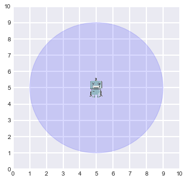
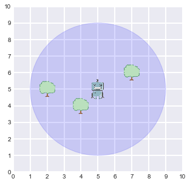
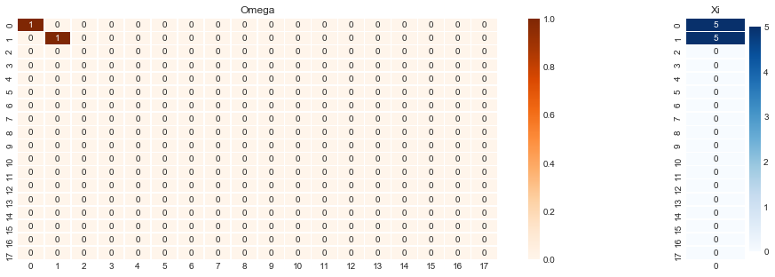
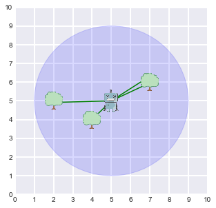
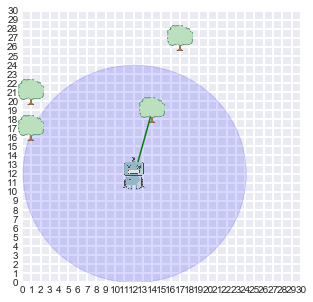
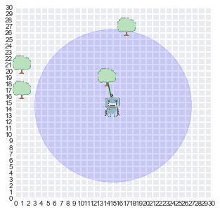
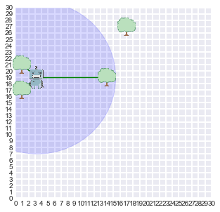
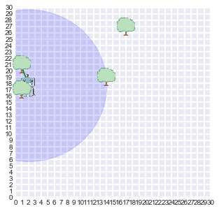
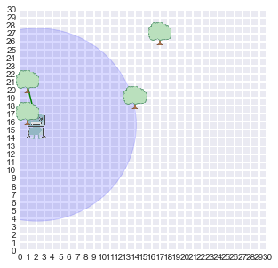
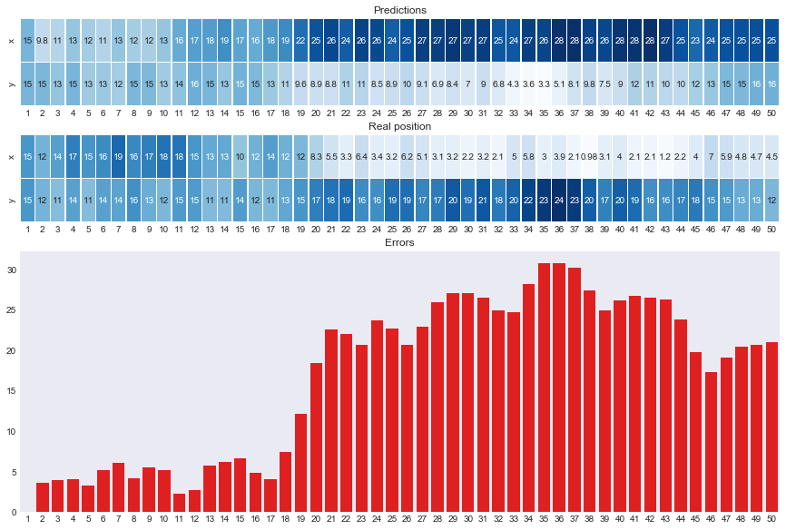

# SLAM SIMULATOR
---


<div class=text-justify style=margin-right:20px style=margin-left:20px>
In this project, I have created a robot that lands in the center of a grid world, and performs a <b>Simulatenous Localization And Mapping</b>.<br>This world will include the <b>agent</b>, and some trees that will act as the <b>landmarks</b>.  
<br><br>  
This agent will have the ability to measure within a range where the trees are with a gaussian noise induced in the measurements, aiming to replicate inexactitude in real worl sensors. <br>  
Furthermore, the robot has the ability to randomly move within the world and keep sensing. This will help the robot update its representation of its belief states to improve the accuracy of its perception. The movement is also affected by gaussian noise in the displacement, to replicate imperfections of the real world robots
<br><br>
Since this projects relies on <b>Graph SLAM</b> approach, the beliefs are registered and computed into the matrices Omega and Xi.
</div>


```python
%matplotlib inline
import numpy as np
import pandas as pd
import seaborn as sns
from pandas import DataFrame
from matplotlib import pyplot as plt

from objects import agent
from utils import display_world, make_landmarks, print_beliefs, plot_estimations
```

The first this is to define the parameters of the world:


```python
# 1 - Construct the world, create the agent and place the landmarks
# -----------------------------------------------------------------
''' Parameters of the world '''
timesteps          = 5                      # Number of time steps the agent will live
world_size         = 10                     # Size of world (square)
measurement_range  = 4                      # Range at which we can sense landmarks
motion_noise       = 0.2                    # Noise in robot motion
measurement_noise  = 0.2                    # Noise in the measurements
num_landmarks = 4                           # Number of Landmarks to include in the world
plt.rcParams["figure.figsize"] = (5,5)      # Size of the visualization of the simulation
```

Now we create the agent and locate it in the center of the world.  
Let's take a look!


```python
# 1.1 - Creates an Agent
r = agent(timesteps, world_size, measurement_range, motion_noise, measurement_noise, comments=True) # allow agent to tell what he is doing
display_world(agent = r)
print(r.measurement_noise)
```





    0.2


That blue circle shows the range of the sensor of our robot. He is able to sense (with the noise in the measurement) and calculate how far he is from the trees that are within this range.   

Talking about trees, let's create them!


```python
# 1.2 - Create any number of landmarks
make_landmarks(r, num_landmarks)
display_world(agent = r)
```





<div class=text-justify>
Ok! Now our robot should be able to detect its surrounding within its measurement range. <br>
Let's wake it up. This function will just initiliaze the Omega and Xi matrices on the agent's brain and update the values corresponding to the first time step (t=0) with its starting point at the center of the world:
<div>

```python
def wakeup(self, N):
        ''' Wake up the agent with this time step life span and the world he is in '''
        self.omega, self.xi = initialize_brain(N, self.num_landmarks, self.world_size)
        self.control.landmarks_ = [(0,0) for _ in range(self.num_landmarks)]
```


```python
# 2 - Agent starts to move and sense the world 
# --------------------------------------------

# 2.1 - Wake up agent
r.wakeup(timesteps)
print('Waking up, initializing system...: ', '\n')
print('Good, I am certain I am at time 0, and position', r)
print_beliefs(r)
```

    Waking up, initializing system...:  
    
    Good, I am certain I am at time 0, and position [x=5.00000 y=5.00000]





Be careful! Increasing the number of landmarks and timesteps will make this matrix bigger, and probably impossible to plot!

At this point, the agent can use its sensors to have its first representation of the world:


```python
# 2.2 - Sense any surrounding landmarks
measurements = r.sense()
display_world(agent = r, estimates = measurements)
```

    * Calculating distance to landmark #1...
    * Thinking, updating my matrices...
    * Calculating distance to landmark #2...
    * Thinking, updating my matrices...
    * Calculating distance to landmark #3...
    * Thinking, updating my matrices...
    * Calculating distance to landmark #4...
    * Thinking, updating my matrices...
    
    
     Alright! I am detecting 4 tree(s) on my sensor range
    --------------------------------------------------------





#### What we see here?
The agent is able to recognize that there is 1 landmark whithin its range.  
It takes that value and uses it to call the **think function** of the agent. So by *thinking*, the agents its updating the matrices omega and xi.

## Entire simulation
---

This time, the agent will iterate over a defined number of timesteps. 
Each time step, the agent will:

- Performs a random move
    - Update its beliefs (Omega and Xi)
- Sense where the landmarks are
    - Update its beliefs
- Age 1 time step (that will help upgrade the matrices)
- Plot the current state of world


```python
# 3 - Move the agent
# ------------------
timesteps = 50
world_size = 30
measurement_range = 12
r = agent(timesteps, world_size, measurement_range, motion_noise, measurement_noise, comments=False) # Deactivate comments of the agent
make_landmarks(r, num_landmarks)
r.wakeup(timesteps)
measurements = r.sense()

for t in range(timesteps - 1):
    
    # 3.1 - Explore the world
    r.move()
    
    # 3.2 - Sense the landmarks within the agent range
    measurements = r.sense()
    
    # 3.3 - Age the agent
    r.get_old()
    
    # 3.4 - Display current picture of the world
    if t % 10 == 0:
        display_world(agent = r, estimates = measurements)
```

















```python
# Now we can take a look at the beliefs of the robot
mu = np.dot(np.linalg.inv(r.omega), r.xi).reshape(-1,2)[:-num_landmarks,:] # Calculate the estimates
re = np.array(r.control.self_)                                             # Grab the real positions stored in the agent
plot_estimations(mu, re)
```





# Questions
---

- Why so big errors?  
After so many time steps and 4 landmarks, shouldn't it be more confident about his previous locations?  
   
   
- Why errors increase over time?
Is this mere coincidende or does it make sense that with the time the errors increase? I don't really see it as the errors are computed all together in a matrix multiplication.  
  
  
- Where is the confidence of each prediction introduced in the guassians?  
We are all the time using ```[[1,-1],[-1,1]]``` but could that be modified using a confidence?  


# Improvements
---
- More realistic situation where the agent moves and senses and picture the worlds one after the other every iteration
- Decoupled classes for landmaks and agents
- Decoupled classes for Omega and Xi wrt the agent, introduced in Brain class and called when agent **```thinks()```**

# To be implemented
---
- Totally decopled world class from agent class
- Upgrade to 3D world with a drone instead of a robot
- Implement an updating omega-xi matrices to update belief state every n time steps out of the total N time steps
